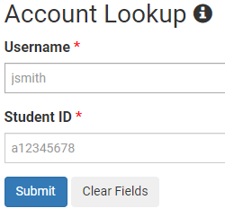
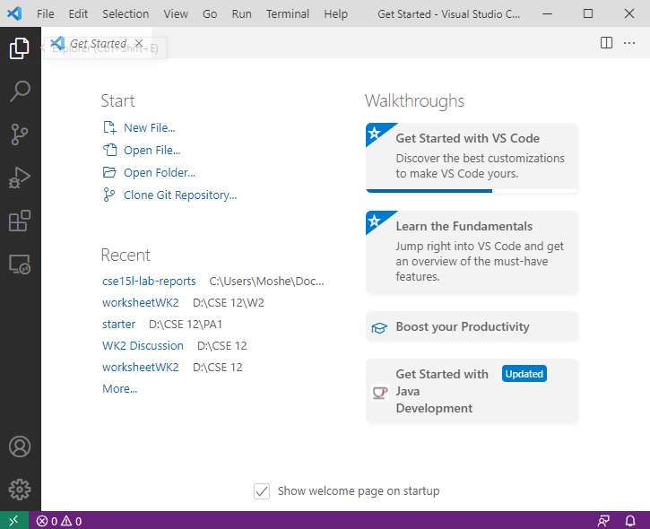

# Lab Report 1
by Moshe Bookstein

# Remote Connection
## Learning to remotely connect to the ieng6 servers
To start this assignment you will need to install OpenSSH, this allows you to use SSH, , to connect to remote locations that support this kind of connection.

Follow this link and then continue below when done.
[Get OpenSSH HERE](https://docs.microsoft.com/en-us/windows-server/administration/openssh/openssh_install_firstuse)

After you install OpenSSH you will need to get your course specifc accpount.

Go to this link and follow the steps below.
[https://sdacs.ucsd.edu/~icc/index.php](https://sdacs.ucsd.edu/~icc/index.php)

Log into your account 

 

