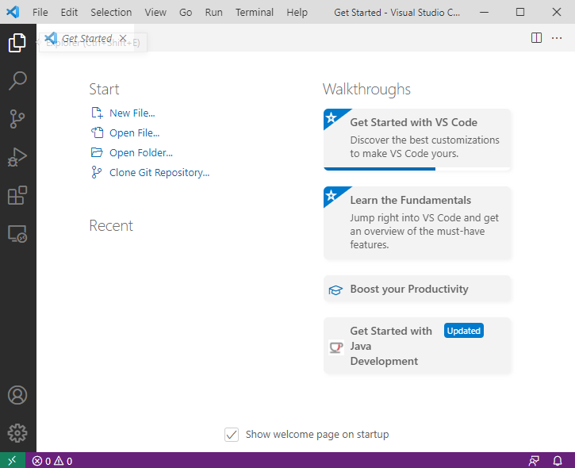
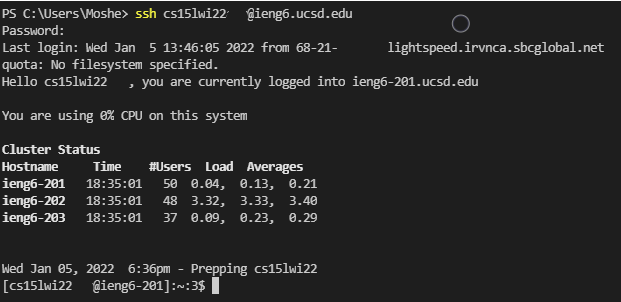
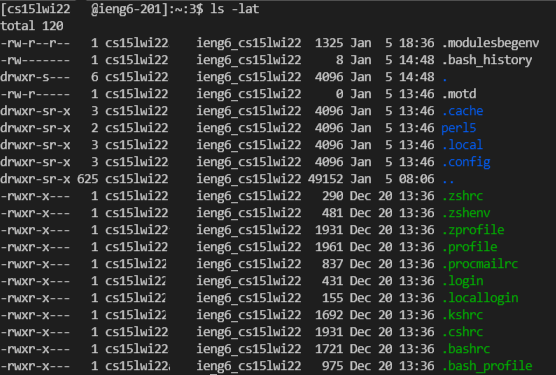
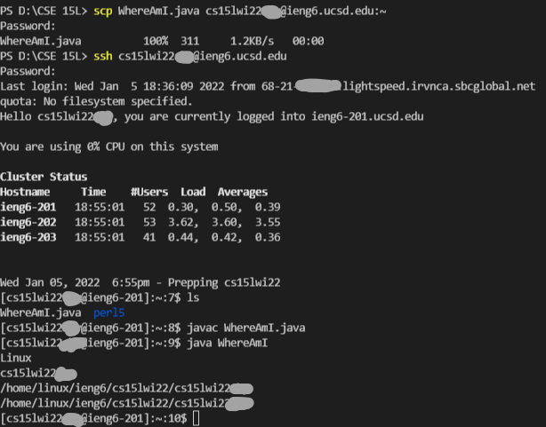
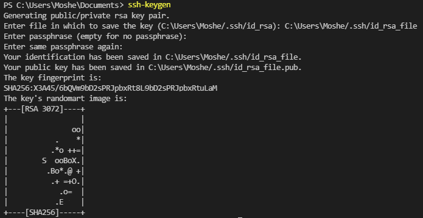
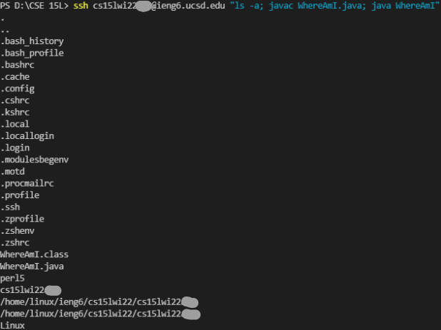

[<- Back](index.html)

# Lab Report 1
by Moshe Bookstein

Updated: Jan 13, 2022 03:35 UTC

[For a summary click here](https://mbookucsd.github.io/cse15l-lab-reports/labreport1.html#summary)

# Full Guide
## Installing VScode
---
The way that these instructions are written is using for use with VScode. However, they are not restricted to it only. If you don't have it installed, here is how you go about installing it.

Visit [https://code.visualstudio.com/](https://code.visualstudio.com/) and click download. After it downloads, click on it and go through the install proccess.

Once you install, you should see this open up




## Remote Connection

### Get OpenSSH
---
To start this assignment you will need to install OpenSSH, this allows you to use SSH to connect to remote locations that support this kind of connection.

Follow this link and then continue below when done.

**[Get OpenSSH Here](https://docs.microsoft.com/en-us/windows-server/administration/openssh/openssh_install_firstuse)**


### Accessing Course-Specific Account
---
After you install OpenSSH you will need to get your course specifc account.

Go to this link and follow the steps below.
**[https://sdacs.ucsd.edu/~icc/index.php](https://sdacs.ucsd.edu/~icc/index.php)**


1. Log into your account 

2. Under 'Additional Accounts' click  the button labled `cs15lwi22***`


Your course specific account is your username listed on the page which is identified by the letters shown at the end of your username.

### Using SSH
---
We will be using Visual Studio Code to connect to the remote servers. Open VSCode and navigate to Terminal -> New Terminal


Enter this into the terminal with `***` replaced with the letters from the end of your username.
```
$ ssh cs15lwi22***@ieng6.ucsd.edu
```
The first time you connect to the server your computer may give you this warning message. 
```
$ ssh cs15lwi22***@ieng6.ucsd.edu
The authenticity of host 'ieng6.ucsd.edu (128.54.70.227)' can't be established.
RSA key fingerprint is SHA256:kshsjr6nYH+sySHnhwerjsu7grPEyZTDl/1xgsyd4cec.
Are you sure you want to continue connecting (yes/no/[fingerprint])? 
```
If this is the first time you've connected to the server, you should click yes. If you keep connecting to the server and keep getting the message then it may mean there's an issue with your connection or someone's trying to interrupt your connection. 

Type ```yes``` and then after hitting enter, type in your password. As you type in your password, nothing should show up on the terminal, but once you put your password in fully, hit enter. if what you get looks like this, congratulations you have successfully logged in. 




## Trying Some Commands
Below are some commands that you might want to try and run.

|Commands |
|-----|
|cd ~|
|cd|
|ls -lat|
|ls -a|
|ls `<directory>` where `<directory>` is /home/linux/ieng6/cs15lwi22/cs15lwi22abc, where the abc is one of the other group members’ username|
|cp /home/linux/ieng6/cs15lwi22/public/hello.txt ~/|
|cat /home/linux/ieng6/cs15lwi22/public/hello.txt|

For example:  `ls -lat`



After you use some of these commands you should log out of the server using either:

* CTRL-D
* Type `exit`


## Moving Files with scp
---
As of now we have seen that we can login to a remote computer and run commands on it. Something that is extremely useful when working on remote computers is be the ability to copy files from your computer to another computer. While there are many ways to do this, the way that we will use in this assignment is called `scp`. SCP (secure copy) is a command that you run from the terminal on the device that has a file you wish to copy to another device. The command copies that file onto the server you that you tell it to. Since you run this from your own terminal, you should not be logged into `ieng6` when running the `scp` command.

To start, we need to file to copy over. On your computer create a file called `WhereAmI.java` and place this code within it. 

```
class WhereAmI {
  public static void main(String[] args) {
    System.out.println(System.getProperty("os.name"));
    System.out.println(System.getProperty("user.name"));
    System.out.println(System.getProperty("user.home"));
    System.out.println(System.getProperty("user.dir"));
  }
}
```

Run it using `javac` and `java` on your computer and see what it prints out. 

Now, using the `scp` command we are going to copy it to the server we were logged into before. In the terminal from the directory where the file we made is located, run the command below replacing `**` with the letters from your course-specific account. 
```
$ scp WhereAmI.java cs15lwi22**@ieng6.ucsd.edu:~/
```
Just like with SSH, it will ask you for a password which you should type in and then hit `enter`. 

Now login to `ieng6` again using SSH, and use the `ls` command. you should see the files in that directory.

While you are still logged into the server, try running the file with `javac` and `java` and see how the output of the file differs from when you ran it locally on your own computer. 




##  **Important!!!** 
***SCP DOES NOT CHECK* if that file already exists in the directory. If it finds a file with the same name, it will just overwrite that file. You should try this, make a change to the file you have saved locally, use SCP to copy it over to the server again, and then run it again and see if the output has changed.** 
---


## Setting an SSH Key
---
While typing your password in once or twice doesn't seem like it takes much time, over the course of even a quarter, you might type it in a hundred or two hundred times. This is a significant amount of time to spend typing in your password and people have figured out better ways of confirming that the person running the command is authorized to do so. We are going to be using something called an SSH key to pre-approve our computer to log into the server without having to type in the password every time. 

The main idea behind an SSH key is that on our computer, we create a public and private key using the command `ssh-keygen` . we give the public key to the server and keep the private key on our machine, and then when we try to log into the server the server will check with our computer that have the private key. If we do it will just log us in. This is an extremely common setup in any work environment that requires using code on a server. 

Below is what you should run on your computer(the client)

*Instead of the file xxxxxxxxxxxxx, enter a path to the new file location on your computer such as C:\Users\Username/.ssh/id_rsa it should be within the .ssh folder of your user account*



If you’re on Windows, follow the extra `ssh-add` steps here: [https://docs.microsoft.com/en-us/windows-server/administration/openssh/openssh_keymanagement#user-key-generation](https://docs.microsoft.com/en-us/windows-server/administration/openssh/openssh_keymanagement#user-key-generation)

This process created two new files on your computer, a **public** key and a *private* key. The private key in the example above is labeled `id_rsa`. The **public** key is labeled very similarly, `id_rsa.pub`. Both are stored in the `.ssh` directory on your computer, which is where they should be located. 

Now that we have generated our key set, you should copy the public key to the `.ssh` directory within your user folder on the server. 

First we need to use `mkdir` to create the directory. Mkdir makes a directory within the directory you currently are in. So `ssh` into the server, and make a directory and then exit the server.

```
$ ssh cs15lwi22**@ieng6.ucsd.edu
Password:
```
```
$ mkdir .ssh
```

Now back on your computer, use `scp` to copy the **PUBLIC** key over to the server.
```
$ scp C:\Users\Username\.ssh cs15lwi22**@ieng6.ucsd.edu:~/.ssh/authorized_keys
```
You should replace the file path above with the file path to your`.pub` file and your course specific account username instead of `cs15lwi22**`

After this file is copied over, you should be able to `ssh` or `scp` to the server without entering your password.

## Optimizing Remote Running
--- 
Now that we have set up power computers to more easily connect to the server, you may be wondering if there's even more pleasant ways of executing commands on the server, and there are. 

Hints:

* After the SSH commands, you can include other commands located within quotes that will execute on the home directory of the server you're logging into. 
```
$ ssh cs15lwi22@ieng6.ucsd.edu "ls -a"
```
* Using the up and down arrow keys will bring up the most recently used commands you have typed in.

* You can separate commands with semi-colons to execute multiple commands in one line like this:



Great job, you can now access, copy files to, and run commands on a remote server.


## Summary

For those of you with no time to spare, here is a quick summary of everything this document goes over.

---
### 1. Installing VScode 

Download and Install VSCode from this link. [https://code.visualstudio.com/](https://code.visualstudio.com/)
If you have already downloaded this before, skip this step.

---
### 2. Remotely Connecting

[Get OpenSSH](https://docs.microsoft.com/en-us/windows-server/administration/openssh/openssh_install_firstuse) if you do not have it already

Get your course specific account from this link. [https://sdacs.ucsd.edu/~icc/index.php](https://sdacs.ucsd.edu/~icc/index.php) Your account looks like this `cs15lwi22***`

Open VSCode and navigate to Terminal -> New Terminal

Use the `ssh` command to log into the `ieng6` server. 
```
$ ssh cs15lwi22***@ieng6.ucsd.edu
```
If you get a warning, type yes.

Enter your password, nothing will show as you type.

---
### 3. Trying Some Commands


Try some commands and see what they do.
|Commands |
|-----|
|cd ~|
|cd|
|ls -lat|
|ls -a|

Log out with either Ctrl-D or by typing `exit`.

---
### 4. Moving Files with scp


To copy a file from your computer to the server, use the `scp` command. 

Create a file called `WhereAmI.java` with this code in it.

```
class WhereAmI {
  public static void main(String[] args) {
    System.out.println(System.getProperty("os.name"));
    System.out.println(System.getProperty("user.name"));
    System.out.println(System.getProperty("user.home"));
    System.out.println(System.getProperty("user.dir"));
  }
}
```

Copy it to the server using the `scp` command.

```
$ scp WhereAmI.java cs15lwi22***@ieng6.ucsd.edu:~/
```

Login to `ieng6` again using `ssh`, and use the `ls` command. You should see the file in that directory.

While you are still logged into the server, try running the file with `javac` and `java` and see how the output of the file differs from when you ran it locally on your own computer.

##  **Important!!!** 
***SCP DOES NOT CHECK* if that file already exists in the directory. If it finds a file with the same name, it will just overwrite that file. You should try this, make a change to the file you have saved locally, use SCP to copy it over to the server again, and then run it again and see if the output has changed.** 
---

### 5. Setting an SSH Key
--- 

SSH keys allow you to use ssh and scp commands without typing your password every time.

Run `ssh-keygen` and go through the proccess below.


We need to make a place to put the file. `ssh` into the server, and make a directory using `mkdir` and then exit the server.

```
$ ssh cs15lwi22***@ieng6.ucsd.edu
Password:
```
```
$ mkdir .ssh
```

Now back on your computer, use `scp` to copy the `.pub` key over to the server.
```
$ scp C:\Users\Username\.ssh cs15lwi22***@ieng6.ucsd.edu:~/.ssh/authorized_keys
```
---
### 6. Optimizing Remote Running

There are some ways to optimise running commands remotely, some are listed below.

1. After the SSH commands, you can include other commands located within quotes that will execute on the home directory of the server you’re logging into.
`$ ssh cs15lwi22@ieng6.ucsd.edu "ls -a"`

2. Using the up and down arrow keys will bring up the most recently used commands you have typed in.

3. You can separate commands with semi-colons within quotes to execute multiple commands in one line like this:
```
ssh cs15lwi22ahy@ieng6.ucsd.edu "ls -a; javac WhereAmI.java; java WhereAmI"
```